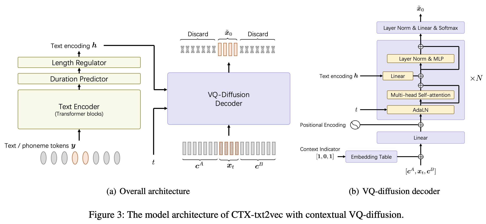

# \[Working in Progress\] CTX-text2vec, the Acoustic Model with Contextual VQ-Diffusion
> This is the official implementation of **CTX-text2vec** TTS model in the paper [UniCATS: A Unified Context-Aware Text-to-Speech Framework with Contextual VQ-Diffusion and Vocoding](https://arxiv.org/abs/2306.07547).



## Environment Setup

This repo is tested on **python 3.7** on Linux. You can set up the environment with conda
```shell
# Install required packages
conda create -n ctxt2v python=3.7 # or any name you like
conda activate ctxt2v
pip install -r requirements.txt
```

Every time you enter this project, you can do `conda activate ctxt2v` or `source path.sh`.

## Training
**Working in progress**

```shell
python train.py --name Libritts --config_file configs/Libritts.yaml --num_node 1 --tensorboard --auto_resume
```

## Decoding
**Working in progress**

```shell
python continuation.py
```

## Acknowledgement
During the development, the following repositories were referred to:
* [ESPnet](https://github.com/espnet/espnet), for the model architecture in `ctx_text2vec/modeling/transformers/espnet_nets` and utility scripts in `utils`.
* [Kaldi](https://github.com/kaldi-asr/kaldi), for most utility scripts in `utils`.
* [VQ-Diffusion](https://github.com/microsoft/VQ-Diffusion), from which the model structures and training pipeline are mostly inherited.